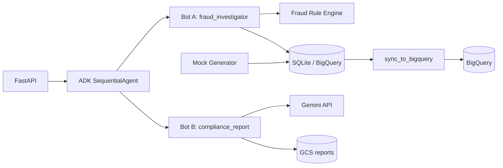

# Agentic Financial Fraud Investigation Platform

Portfolio-grade **GCP GenAI** project implementing **Option 1: Multi-Agent Financial Fraud Detective** — a banking-style fraud workflow with an on-premise transaction store, **BigQuery** analytics sync, **Google ADK** multi-agent orchestration, and **Gemini**-powered compliance reporting.

## What this project does

A client bank needs to investigate complex fraud across large transaction volumes. This platform:

1. **Simulates** an on-premise OLTP database (SQLite) with realistic mock transactions and seeded fraud patterns.
2. **Syncs** transactions to **BigQuery** (Phase 2) for warehouse-scale analytics.
3. Runs **Bot A (Fraud Investigator)** — rule-based detection with full explainability and audit logs.
4. Runs **Bot B (Compliance Report)** — formal regulator-style SAR narrative via **Gemini API** (template fallback when no key/quota).
5. Exposes everything through a **FastAPI** REST API and optional **ADK Web UI**.

```text
┌─────────────────┐     sync      ┌──────────────┐
│ SQLite (on-prem)│ ────────────► │  BigQuery    │
└────────┬────────┘               └──────┬───────┘
         │                               │
         ▼                               ▼
   Bot A: Investigator ──findings──► Bot B: Compliance (Gemini)
         │                               │
         └──────── ADK SequentialAgent ──┘
                        │
                   FastAPI REST API
```

## Architecture



### Option 1 requirements mapping

| Requirement | Implementation |
|-------------|----------------|
| On-prem transactional DB | `app/database.py` — SQLite (`data/fraud_platform.db`) |
| Sync to BigQuery | `POST /sync-to-bigquery`, `scripts/sync_to_bigquery.py`, `AUTO_SYNC_BIGQUERY` |
| Multi-agent with **ADK** | `app/agents.py` — `SequentialAgent` + ADK `Runner` (`USE_ADK=true`) |
| Bot A queries BigQuery | `FraudInvestigatorAgent` when `USE_BIGQUERY=true` |
| Bot B + Gemini report | `ComplianceReportAgent` — Gemini or template fallback |
| Explainability & audit | Per-finding `explanation` + `evidence`; `audit_logs` table |

```text
fraud_investigation_coordinator (ADK SequentialAgent)
  ├── fraud_investigator   (Bot A — SQLite/BigQuery + 5 fraud rules)
  └── compliance_report    (Bot B — Gemini SAR-style Markdown)
```

Set `USE_ADK=false` to use the legacy Python orchestrator (same APIs, no ADK Runner).

### Fraud detection rules (Bot A)

| Rule | ID | Description |
|------|-----|-------------|
| High-value unusual | R1 | Amount > threshold and > 3× account average |
| Rapid repeated transfers | R2 | ≥ N transfers within M minutes |
| Mule-account pattern | R3 | Many inbound sources + large outbound within 24h |
| Cross-border anomaly | R4 | International txns vs domestic baseline |
| Account velocity spike | R5 | Hourly txn count > 3× baseline |

Every flagged transaction includes **explanation**, **evidence JSON**, and an **audit_logs** entry.

---

## Project structure (flat layout — easy to review)

```
ai_fraud_detection/
├── app/
│   ├── main.py          # FastAPI entrypoint
│   ├── routes.py        # REST endpoints
│   ├── agents.py        # Bot A, Bot B, ADK + legacy orchestration
│   ├── services.py      # Fraud rules, mock data, BQ, GCS, audit, sync
│   ├── database.py      # SQLAlchemy models + sessions
│   ├── schemas.py       # Pydantic request/response models
│   └── config.py        # Environment settings
├── adk_agents/fraud_detective/agent.py   # `adk web` CLI entrypoint
├── scripts/
│   ├── demo.sh
│   └── sync_to_bigquery.py
├── tests/test_app.py
├── terraform/           # BigQuery + GCS + Cloud Run
├── samples/demo_output.txt
├── Dockerfile
├── Makefile
├── requirements.txt
└── .env.example
```

**12 Python source files** (excluding `.venv`) — consolidated for portfolio submission.

---

## Quick start (Phase 1 — local)

### Prerequisites

- Python 3.11+
- Optional: [Gemini API key](https://aistudio.google.com/apikey) for Agent B live reports

### Setup

```bash
cd ai_fraud_detection
python3 -m venv .venv
source .venv/bin/activate
pip install -r requirements.txt
cp .env.example .env
mkdir -p data
```

### Configure `.env` (minimum)

```bash
# Required for local demo (defaults work)
DATABASE_URL=sqlite:///./data/fraud_platform.db
USE_ADK=true

# Optional — live Gemini reports (Agent B)
GEMINI_API_KEY=your_key_here
GEMINI_MODEL=gemini-2.0-flash
```

> **Security:** Never commit `.env`. Add your key only locally.

### Run the API

```bash
make run
# or: uvicorn app.main:app --reload --host 127.0.0.1 --port 8000
```

- Swagger UI: http://127.0.0.1:8000/docs  
- Health: http://127.0.0.1:8000/health  

### Demo workflow

```bash
# Terminal 1 — API (if not already running)
make run

# Terminal 2 — full pipeline
make demo
```

**Manual curl steps:**

```bash
# 1) Generate mock transactions (includes seeded fraud patterns)
curl -s -X POST http://127.0.0.1:8000/generate-transactions \
  -H "Content-Type: application/json" \
  -d '{"count": 500, "fraud_ratio": 0.08, "seed": 42}' | jq .

# 2) Run ADK investigation (Bot A → Bot B)
curl -s -X POST http://127.0.0.1:8000/run-fraud-investigation \
  -H "Content-Type: application/json" \
  -d '{"lookback_hours": 336}' | jq .

# 3) Review findings (explainability)
curl -s "http://127.0.0.1:8000/findings?limit=5" | jq .

# 4) Latest compliance report
curl -s http://127.0.0.1:8000/reports/latest | jq -r '.body_markdown' | head -60
```

Sample output: [`samples/demo_output.txt`](samples/demo_output.txt)

### Tests

```bash
make test
# or: pytest -q
```

Expect **6 passed** (~2s). Integration tests use in-memory SQLite with ADK enabled; live Gemini is disabled in `tests/conftest.py`.

With the API running (`make run`), verify the full HTTP flow:

```bash
make e2e
# or: python scripts/e2e_verify.py http://127.0.0.1:8000
```

### ADK Web UI (optional)

```bash
export GOOGLE_API_KEY=$GEMINI_API_KEY
adk web adk_agents/fraud_detective
```

---

## REST API

| Method | Path | Description |
|--------|------|-------------|
| `GET` | `/health` | Status, ADK/BQ/Gemini flags |
| `POST` | `/generate-transactions` | Generate mock banking data |
| `POST` | `/sync-to-bigquery` | Sync on-prem → BigQuery |
| `POST` | `/run-fraud-investigation` | ADK pipeline: Bot A → Bot B |
| `GET` | `/findings` | List findings (`?investigation_id=`) |
| `GET` | `/reports/latest` | Latest compliance report |

**Investigation request body:**

```json
{
  "account_id": null,
  "lookback_hours": 336,
  "generate_report": true,
  "sync_bigquery": false
}
```

Set `"sync_bigquery": true` (or `AUTO_SYNC_BIGQUERY=true`) to sync SQLite → BigQuery before Bot A runs.

---

## Configuration reference

| Variable | Default | Description |
|----------|---------|-------------|
| `DATABASE_URL` | `sqlite:///./data/fraud_platform.db` | On-prem DB |
| `USE_ADK` | `true` | ADK `SequentialAgent` orchestration |
| `USE_BIGQUERY` | `false` | Bot A reads from BigQuery |
| `AUTO_SYNC_BIGQUERY` | `false` | Auto-sync after generate/investigate |
| `GCP_PROJECT_ID` | — | Required for BigQuery/GCS |
| `BIGQUERY_DATASET_ID` | `fraud_investigation` | BQ dataset |
| `GCS_BUCKET_NAME` | — | Compliance report storage |
| `GEMINI_API_KEY` | — | Agent B Gemini reports |
| `GEMINI_MODEL` | `gemini-2.0-flash` | Gemini model |
| `HIGH_VALUE_THRESHOLD_USD` | `10000` | Rule R1 threshold |
| `RAPID_TRANSFER_MIN_COUNT` | `5` | Rule R2 min transfers |
| `VELOCITY_SPIKE_MULTIPLIER` | `3.0` | Rule R5 spike factor |

See [`.env.example`](.env.example) for the full list.

---

## Phase 2 — GCP integration

### Terraform resources (free-tier friendly)

| Resource | Purpose |
|----------|---------|
| BigQuery dataset | `transactions`, `findings`, `reports` |
| GCS bucket | Compliance `.md` reports (90-day lifecycle) |
| Cloud Run | FastAPI API (scale-to-zero) |

**Not used:** GKE, always-on VMs, Vertex dedicated endpoints.

### Deploy

```bash
cd terraform
cp terraform.tfvars.example terraform.tfvars
# Edit: project_id, bucket_name (globally unique), container image

terraform init && terraform plan && terraform apply
```

### Build & push container

```bash
export PROJECT_ID=your-gcp-project
export REGION=us-central1
gcloud builds submit --tag ${REGION}-docker.pkg.dev/${PROJECT_ID}/fraud/api:latest .
```

### Sync & investigate on BigQuery

```bash
export GCP_PROJECT_ID=your-project
export USE_BIGQUERY=true
export GOOGLE_APPLICATION_CREDENTIALS=/path/to/service-account.json

make sync-bq
# or: python scripts/sync_to_bigquery.py

curl -s -X POST http://127.0.0.1:8000/run-fraud-investigation \
  -H "Content-Type: application/json" \
  -d '{"sync_bigquery": true, "lookback_hours": 336}' | jq .
```

### Cloud Run environment

Set `GCP_PROJECT_ID`, `BIGQUERY_DATASET_ID`, `GCS_BUCKET_NAME`, `USE_BIGQUERY=true`, `GEMINI_API_KEY`, and `DATABASE_URL=sqlite:////tmp/fraud.db`.

---

## Responsible AI controls

- **Human-in-the-loop** — Reports require qualified compliance officer review before SAR filing.
- **Explainability** — Every finding has rule ID, natural-language explanation, and structured evidence.
- **Audit trail** — Immutable `audit_logs` for generation, flags, investigations, and reports.
- **No real PII** — Synthetic Faker-generated data only.
- **Gemini guardrails** — Temperature 0.2; prompt limited to provided findings JSON.
- **Graceful fallback** — Template report when API key missing or quota exceeded (no crash).

---

## Cost control

- BigQuery: batch sync; query capped at 50k rows / `lookback_hours`
- Cloud Run: min instances = 0, max = 2, 512Mi RAM
- GCS: 90-day lifecycle delete on reports bucket
- Gemini: Flash model; template mode is free for demos

---

## Interview talking points

1. **Why multi-agent?** Separates deterministic investigation (Bot A) from narrative compliance (Bot B) — testable, auditable, swappable models.
2. **Why SQLite + BigQuery?** Mirrors banking: OLTP on-prem → cloud warehouse for analytics at scale.
3. **Why rules + LLM?** Rules deliver AML explainability; Gemini only synthesizes the regulator narrative from structured findings.
4. **Why ADK?** `SequentialAgent` + `Runner` provide a production-aligned Google agent framework; legacy path available for simplicity.
5. **Scale path** — Partition BQ by date, Pub/Sub ingest, Secret Manager, VPC-SC, human review queue.

---

## Submission checklist

- [ ] `cp .env.example .env` and add `GEMINI_API_KEY` locally (do not commit)
- [ ] `make test` — 6 passed
- [ ] `make run` + `make e2e` + `make demo` — capture terminal output or screenshots
- [ ] Push to GitHub without `.env`, `.venv/`, `data/`, `.pytest_cache/`
- [ ] Optional: Phase 2 Terraform apply + one BigQuery investigation screenshot

---

## License

Apache-2.0 — portfolio and educational use.
